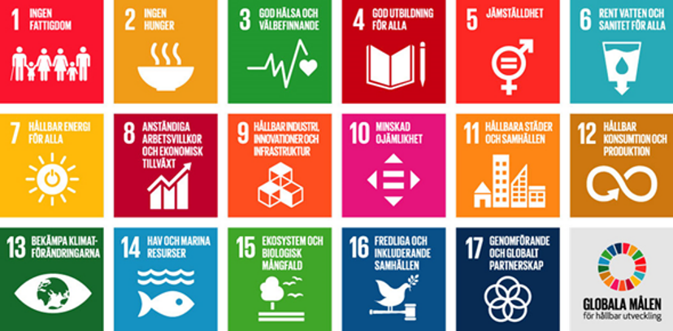
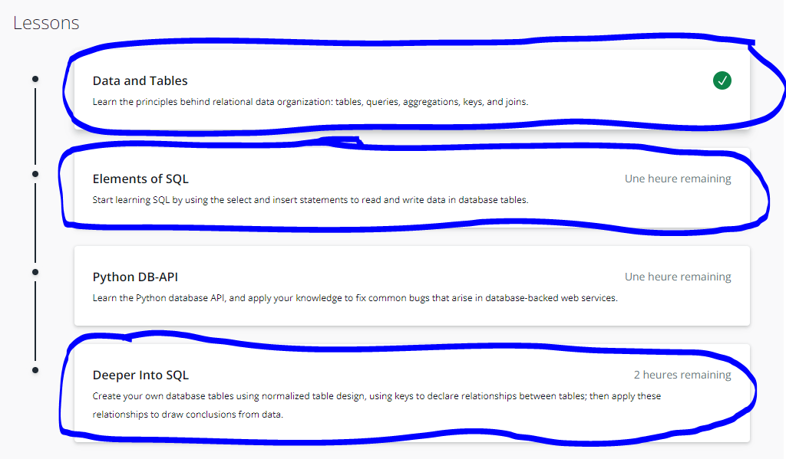
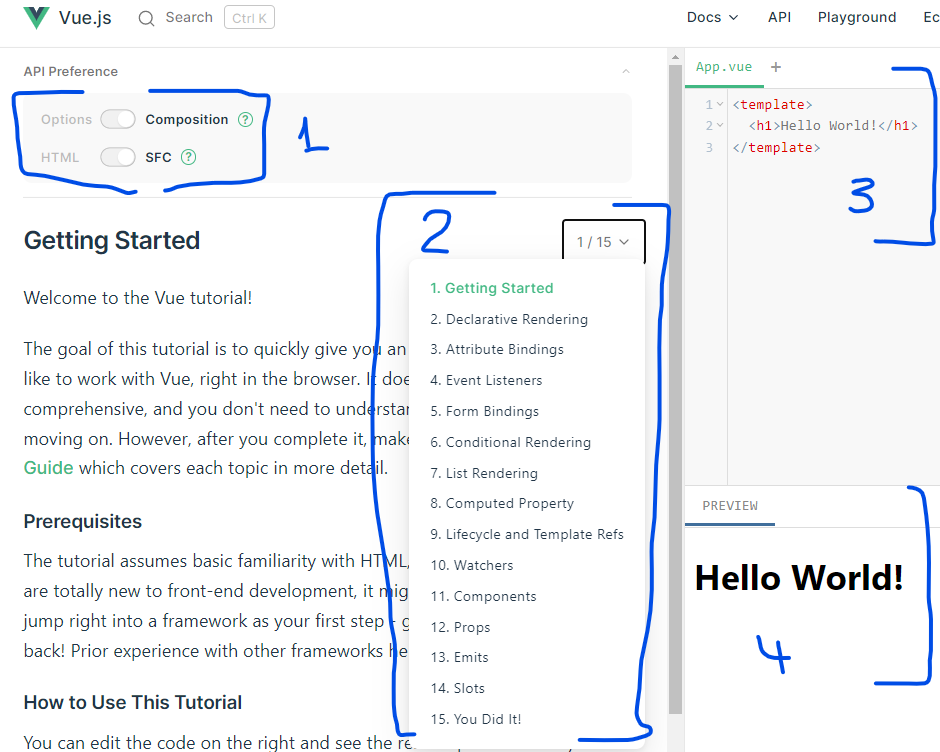

# FN Globala Mål Projektet

Välkommen till första projektet under våren, i det här projektet kommer vi lära oss bygga applikationer över hela stacken, både backend och frontend.  
Teknikerna vi kommer lära oss är:

### 1. Relationsdatabaser, SQL, och PostgresSQL 

Relationsdatabaser är de vanligaste och populäraste typen av databaser i världen, där några exempel är PostgreSQL, MySQL, SQL Server m.m 

### 2. Webbtjänster med Node & Express, och ORM (Object Relational Mapper) med Prisma  

Vi kommer sedan titta på hur man bygger en webbtjänst med Node och Express som ska kommunicera med vår databas i del 1.  
Därefter kommer vi använda en ORM som gör det enkelt att omvandla anrop till SQL frågor. 

### 3. Webb- och apputveckling, Vue 3, Quasar Framework 

Vi har sedan tidigare jobbat med Quasar men här kommer vi lära oss Vue 3 som vi inte jobbat med tidigare. Applikationen ska kommunicera med vår webbtjänst från del 2.
 

Dessa tekniker kommer appliceras på att lösa ett problem inom FNs globala mål.

</img>

1. Hitta ett problem inom något av de 17 globala målen som FN satt vilken kan förbättras lösas med hjälp av digitalisering.
   En hemsida eller app.
2. Ni ska bygga en prototyp på lösningen med det ni lärt er kursmomenten.
3. Ni jobbar med projektet inom era basgrupper.
   Jeton kommer gå igenom hur vi jobbar med Github Flow och kanbans för bästa resultat och samarbete inom gruppen.

# 1. Relationsdatabaser, SQL, och PostgresSQL

Vi kommer använda den här kursen från utbildningsplattformen Udacity när vi lär oss om relationsdatabaser och SQL.  
I del två på kursen så använder dem Python men vi kommer hoppa över den delen utan ni ska göra delarna 1, 2 och 4.

<a href="https://www.udacity.com/course/intro-to-relational-databases--ud197">https://www.udacity.com/course/intro-to-relational-databases--ud197</a>

</img>

W3Schools har också bra information om SQL!
<a href="https://www.w3schools.com/sql/default.asp">https://www.w3schools.com/sql/default.asp</a>

<a href="https://www.studytonight.com/dbms/database-normalization.php">Studytonight https://www.studytonight.com/dbms/database-normalization.php</a> bra SQL resurser speciellt om normaliseringsreglerna.

För att använda PostgresSQL på era datorer så behöver vi installera det enligt följande länk. Ni behöver troligtvis admin hjälp från lärare vid installationen.

https://www.postgresqltutorial.com/postgresql-getting-started/install-postgresql/

https://www.postgresqltutorial.com/postgresql-getting-started/postgresql-sample-database/

När kursen är klar för alla i basgruppen ska ni skapa ett databas/relationsdiagram för er applikation. Dvs ni ska bryta ner vilka entiteter/objekt som ingår och deras relationer.

- Vilka tabeller och kolumner
- Data typer på kolumnerna
- Primary-keys och Foreign-keys för varje tabell

Exempel på ett diagram ett DVD film-hyrningstjänst.

</img>

För att skapa ett sådant diagram kan ni använda webbsidan: <a href="https://app.diagrams.net/">https://app.diagrams.net/</a>

# 2. Webbtjänster med Node & Express, och ORM (Object Relational Mapper) med Prisma

<a href="https://blog.logrocket.com/crud-rest-api-node-js-express-postgresql/">CRUD REST API with Node.js, Express, and PostgreSQL</a>

<a href="https://www.dawsoncodes.com/posts/5/building-a-rest-api-with-prisma-and-expressjs">Prisma tutorial</a>

<a href="https://www.youtube.com/watch?v=HCJmlvgO2WY">Prisma video tutorial</a>

# 3. Webb- och apputveckling, Vue 3, Quasar Framework

# VUE

Vue 3 är den senaste versionen av Vue och versionen vi kommer att använda.

## Intro

Nästa del i vår JavaScript resa är att lära oss om Vue.js för att enklare och snabbare kunna utveckla applikationer.

- Vue är ett progressivt open-source ramverk för att bygga användargränssnitt, till en början utvecklad av en Google avhoppare som heter Evan You, men underhålls idag av ett team.

- Core delen av ramverket är endast fokuserat på visningsskiktet och är enkelt att komma igång med.

- Vue är också fullt kapabelt att bygga sofistikerade applikationer (Single Page Applications).

- Vue är flexibelt och enkelt.

- Vue tillåter dig att använde det i en del av en befintlig applikation (plugin) eller hantera hela applikationen från start (CLI).

- Vue-Directives är den del av Vue.js som lägger speciell betydelse och beteende till vanliga html-element på sidan.

- Vue förser oss med reaktivitet vilket gör att våra vyer/sidor automagiskt uppdateras när vårat data ändras.

## Steg 1

Börja med att hämta ner powerpointen med namnet Vue.pptx och gå igenom innehållet på länken **Vue 3 Hands On** och lös övningsuppgifterna där. Vill man titta på en Youtube video om Vue 3 rekommenderas ** Vue 3 With Danny**.  
 

- [Vue 3 Hands On](https://vuejs.org/tutorial/#step-1)

På Vue Hands On får man en miljö för att öva och testa Vue.
Viktigt att man enligt bilden har:

1. Valt Composition och SFC.
2. Gör man alla uppgifter och förstått då har man bra koll på Vue.
3. Vi skriver vår Vue kod på över delen av höger sida.
4. Man ser resultatet på nedre delen av höger sida.

## Övergripande resurser för denna modul:

- [Vue 3 Hands On](https://vuejs.org/tutorial/#step-1)
- [Vue](https://vuejs.org/guide/quick-start.html)
- [Youtube - Vue 3 With Danny](https://www.youtube.com/watch?v=9whgkjxoCME)

## 1.1 Getting started

- [Vue 3 Hands On](https://vuejs.org/tutorial/#step-1)

## 1.2 Interpolation

[Vue.js Interpolation Declarative Rendering](https://vuejs.org/tutorial/#step-2)  

## 1.3 Attribute Binding

[Vue.js Attribute Binding](https://vuejs.org/tutorial/#step-3)  

## 1.4 Event hanterare (klicka på knapp)

[Vue.js Event Listeners](https://vuejs.org/tutorial/#step-4)  

## 1.5 Tvåvägs binding

[Vue.js Form Bindings](https://vuejs.org/tutorial/#step-5)  

## 1.6 Villkor

[Vue.js Conditional Rendering](https://vuejs.org/tutorial/#step-6)  

## 1.7 Visa Listor

[Vue.js List Rendering](https://vuejs.org/tutorial/#step-7)  

## 1.8 Computed Property

[Vue.js Computed Property](https://vuejs.org/tutorial/#step-8)  

## 1.9 Livscykel event

[Vue.js Lifecycle and Template Refs](https://vuejs.org/tutorial/#step-9)

## 1.10 Watchers

[Vue.js Watchers](https://vuejs.org/tutorial/#step-10)  

## 1.11 Components

[Vue.js Components](https://vuejs.org/tutorial/#step-11)  

## 1.12 Component Communication - Props

Skicka data från parent-component till en child-component  
[Vue.js Watchers](https://vuejs.org/tutorial/#step-12)  

## 1.12 Component Communication - Props

Skicka data från en parent-component till en child-component

[Vue.js Props](https://vuejs.org/tutorial/#step-12)  

## 1.13 Component Communication - Emit Events

Skicka data från en child-component till en parent-component

[Vue.js Emit Events](https://vuejs.org/tutorial/#step-13)  

## 1.14 Slots

### Resurser

[Vue.js Slots](https://vuejs.org/tutorial/#step-14)  

# För Quasar delarna kolla i mappen Quasar Framework.
